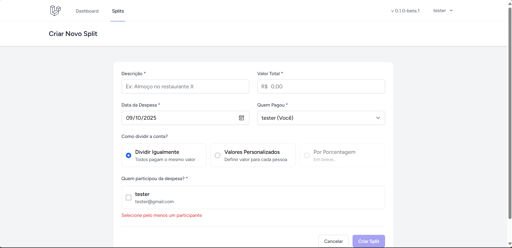
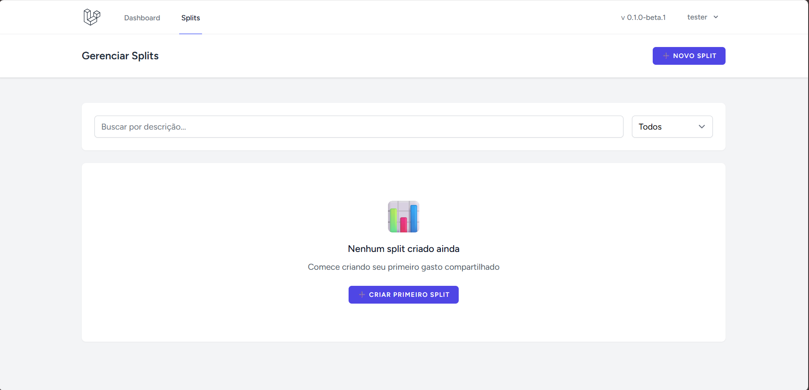
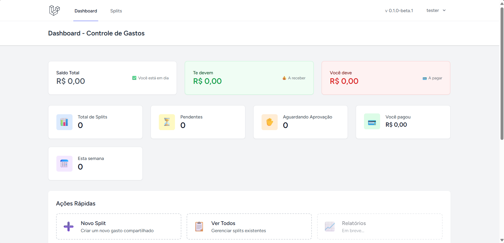

# Split Control

Versão: v0.1.0-beta.1 — Beta inicial

Sistema de controle de despesas compartilhadas (splits) — backend em Laravel e front-end em React (Inertia).

Esta é a versão beta inicial do projeto. Destina-se a testes e feedback; algumas funcionalidades estão estáveis, outras ainda em desenvolvimento ou instáveis (detalhes abaixo).

## Recursos (esta versão beta)

Funcionalidades ativas:

- Criação de split (despesa compartilhada)

- Listagem de splits

- Visualização de split
- Login / Logout
- Recuperação de senha (reset)
- Filtro funcional em listagens (busca/filtragem básica)
- Sistema de exclusão de split (remover despesa)

Funcionalidades em desenvolvimento ou instáveis:

- Dashboard: ainda em desenvolvimento

- Edição de split: funcionalidade presente, porém instável
- Controle de user balance: presente, mas ainda instável (recomenda-se cautela)

Funcionalidades não implementadas nesta versão:

- Landing page SPA inicial (ainda não criada)

Observação: esta versão foi publicada como beta para permitir testes iniciais e feedback rápido; espere bugs e mudanças na API/UX.

## Tecnologias

- PHP 8.x + Laravel
- React + Inertia.js
- Vite, Tailwind CSS
- SQLite (por padrão de desenvolvimento)

## Pré-requisitos

- PHP 8.x
- Composer
- Node.js + npm (ou pnpm)
- Git

## Instalação (desenvolvimento)

Siga estes passos no Windows (cmd.exe) a partir da raiz do projeto:

```cmd
composer install
copy .env.example .env
php artisan key:generate
rem criar o arquivo sqlite se usar sqlite
type NUL > database\database.sqlite
php artisan migrate --seed
npm install
npm run dev
php artisan serve --port=8001
```

Observações:
- Se preferir usar outro DB (MySQL/Postgres), atualize `.env` com as credenciais e remova/ajuste a linha do sqlite.
- A porta 8001 é um exemplo; ajuste conforme necessário.

## Configuração de ambiente e secrets

Após clonar o repositório, copie o arquivo de exemplo e gere a chave da aplicação:

```cmd
copy .env.example .env
php artisan key:generate
```

Se for usar o banco sqlite para desenvolvimento, crie o arquivo:

```cmd
type NUL > database\database.sqlite
```

Para habilitar uploads de sourcemaps para o Sentry via GitHub Actions, adicione os seguintes secrets no repositório (Settings → Secrets and variables → Actions) ou via `gh` CLI:

 - `SENTRY_AUTH_TOKEN` (token com permissão de releases)
 - `SENTRY_ORG` (slug da organização Sentry)
 - `SENTRY_PROJECT` (slug do projeto Sentry)
 - `VITE_SENTRY_DSN` (opcional, para embutir o DSN no build)
 - `SENTRY_ENABLED` (defina `true` para permitir upload automático em releases)

Exemplo com `gh` CLI (Windows cmd.exe):

```cmd
gh secret set SENTRY_AUTH_TOKEN --body "SEU_TOKEN_DO_SENTRY"
gh secret set SENTRY_ORG --body "sua-org-slug"
gh secret set SENTRY_PROJECT --body "seu-project-slug"
gh secret set VITE_SENTRY_DSN --body "https://publicKey@o0.ingest.sentry.io/0"
gh secret set SENTRY_ENABLED --body "true"
```

## Uso rápido

- Acesse a aplicação em http://127.0.0.1:8001 (ou na porta escolhida).
- Faça login com um usuário seed (ou registre um) e navegue até a seção de Splits.
- Crie uma despesa, escolha quem pagou e adicione participantes (incluindo você).

## Conta de teste (seed)

Para facilitar testes locais, existe um usuário seed criado pelo `DatabaseSeeder`:

- Email: `test@example.com`
- Senha: `password`

Nota: a senha acima é usada apenas para desenvolvimento/local e é armazenada hashed no banco. Troque ou remova esse usuário antes de publicar em produção.

## Testes

Executar os testes unitários/funcionais:

```cmd
vendor\bin\phpunit
```

## Scripts úteis

- `npm run dev` — ambiente de desenvolvimento (HMR)
- `npm run build` — build de produção dos assets
- `php artisan migrate` — rodar migrations
- `php artisan db:seed` — popular dados de exemplo

## Integração contínua, Sentry e Dependabot

O repositório inclui workflows GitHub Actions para CI e releases.

- `CI` (`.github/workflows/ci.yml`) roda PHPStan, Pint, PHPUnit, lint JS e build de assets em pushes/PRs para `main`.
- `Release` (`.github/workflows/release.yml`) atualiza o arquivo `VERSION` quando uma tag `v*.*.*` é criada.
- `Release with Sentry` (`.github/workflows/release-sentry.yml`) tenta enviar sourcemaps para o Sentry quando os segredos `SENTRY_AUTH_TOKEN`, `SENTRY_ORG`, e `SENTRY_PROJECT` estiverem definidos no repo.
- `Dependabot` (`.github/dependabot.yml`) verifica atualizações semanais para `npm` e `composer`.

Como configurar Sentry (opcional):

1. Crie um projeto no Sentry.
2. Adicione os segredos no GitHub: `SENTRY_AUTH_TOKEN`, `SENTRY_ORG`, `SENTRY_PROJECT`.
3. Nas builds de release, o workflow `release-sentry.yml` publicará sourcemaps automaticamente.

## Automação presente em `.github/` (workflows)

Este repositório inclui uma pasta `.github/` com automações que ajudam CI, releases e manutenção de dependências. Resumo rápido:

- `CI` — `./github/workflows/ci.yml`:
	- Quando: `push` e `pull_request` para `main`.
	- O que roda: instalação de dependências, PHPStan, Pint, PHPUnit (suites), lint JS e build dos assets.
	- Objetivo: garantir qualidade antes de merge.

- `Release` — `./github/workflows/release.yml`:
	- Quando: `push` de uma tag no formato `v*.*.*`.
	- O que faz: escreve/atualiza o arquivo `VERSION` na branch `main` e cria uma Release no GitHub com a tag.

- `Release with Sentry` — `./github/workflows/release-sentry.yml`:
	- Quando: `push` de uma tag `v*.*.*`.
	- O que faz: build com sourcemaps e, se os secrets do Sentry estiverem configurados, cria um release no Sentry e envia sourcemaps.
	- Secrets necessários (definir no repo): `SENTRY_AUTH_TOKEN`, `SENTRY_ORG`, `SENTRY_PROJECT` e opcionalmente `VITE_SENTRY_DSN` para embutir o DSN no build.

- `Dependabot` — `./github/dependabot.yml`:
	- Quando: atualizações agendadas (weekly) para `npm` e `composer`.

Segurança e secrets
- Não coloque tokens no código ou em arquivos versionados. Use `GitHub Secrets` (Settings → Secrets and variables → Actions).
- Pull requests a partir de forks não têm acesso aos secrets por padrão.

Comandos úteis (Windows cmd.exe) para adicionar os secrets via `gh` CLI:

```cmd
gh secret set SENTRY_AUTH_TOKEN --body "SEU_TOKEN_AQUI"
gh secret set SENTRY_ORG --body "sua-org-slug"
gh secret set SENTRY_PROJECT --body "seu-project-slug"
gh secret set VITE_SENTRY_DSN --body "https://publicKey@o0.ingest.sentry.io/0"
```

Criar uma tag semântica e disparar release:

```cmd
git tag -a v1.0.0 -m "Release v1.0.0"
git push origin v1.0.0
```

Notas finais
- Os workflows são executados pelo GitHub Actions; se o repositório for público, os arquivos em `.github/` são visíveis para qualquer pessoa. Secrets e tokens permanecem privados e só são expostos ao runner quando o workflow é executado.


## Estrutura importante

- `app/` — código Laravel (Controllers, Models, Services)
- `resources/js/Pages` — páginas React + Inertia
- `database/` — migrations, seeders e `database.sqlite`
- `routes/web.php` — rotas da aplicação

## Contribuindo

Contribuições são bem-vindas. Sugestões:

1. Abra um issue descrevendo a proposta ou bug.
2. Fork o repositório e crie uma branch com nome claro (`feat/`, `fix/`).
3. Faça commits pequenos e descritivos.
4. Abra um pull request apontando para `main` e descreva as mudanças.

Siga o Code of Conduct e adicione testes para alterações relevantes.

## Licença

Este projeto será publicado como open source sob a licença MIT.

## Contato

Para dúvidas ou para reportar problemas, abra uma issue no GitHub ou me contate pelo email no perfil do repositório.

---

## Controle de versão exibido na navbar

A aplicação exibe a versão atual na barra superior (navbar). A versão é lida da variável de ambiente `APP_VERSION` e também é compartilhada como prop global pelo backend (Inertia).

Como definir ou atualizar a versão:

1. Abra o arquivo `.env` na raiz do projeto e defina `APP_VERSION`, por exemplo:

```text
APP_VERSION=v0.1.0
```

2. Reinicie o servidor de desenvolvimento (`php artisan serve`) e atualize a página no navegador para ver a versão na navbar.

Controle semântico com Git tags (recomendado):

- Crie uma tag local (ex.: v0.1.0):

```bash
git tag -a v0.1.0 -m "Release v0.1.0"
git push origin v0.1.0
```

- Opcional: adicione um `CHANGELOG.md` com entradas como:

```
Add: criação de splits, seleção de participantes e pagador.
Fix: UX na seleção de participantes.
Docs: README em PT-BR.
```

Observação: o `APP_VERSION` no `.env` é a fonte de verdade exibida na UI; use tags apenas para versionamento Git e releases no GitHub.
